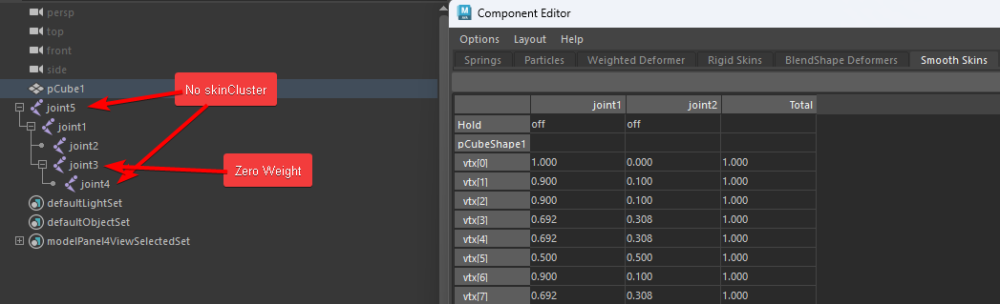

# 零权重骨骼探测器

用于检测和分析Maya场景中的骨骼权重情况

主要用途：

1. FBX导出前的清理工作
    - 识别可以安全移除的零权重骨骼
    - 帮助减少导出文件的大小
    - 避免将不必要的骨骼导出到游戏引擎

2. 场景优化和维护
    - 快速定位可能不需要的骨骼
    - 协助技术美术进行场景清理
    - 优化绑定结构

使用方法：

1. 选择要检查的mesh物体
2. 运行脚本
3. 查看分析结果：
    - 零权重骨骼：已添加到skinCluster但没有实际权重的骨骼
    - 未绑定骨骼：在骨骼层级中但未添加到skinCluster的骨骼

## 再现场景

一个简单的测试场景。

[TALL03100_maya_zero_weight_bones_detector.mb](TALL03100/TALL03100_maya_zero_weight_bones_detector.mb)

| Name   | HasWeight | HasSkinCluster |
|--------|-----------|----------------|
| joint5 | X         | X              |
| joint1 | 〇         | 〇              |
| joint2 | 〇         | 〇              |
| joint3 | X         | 〇              |
| joint4 | X         | X              |



打开测试场景后，点击`pCube1`后执行，[脚本](TALL03100/maya_zero_weight_bones_detector.py)会在**ScriptEditor**中出现如下信息。


```text
===== pCube1 的骨骼分析结果 =====

1. 零权重骨骼 (1个):
- joint3 (父骨骼: joint1)

2. 没有skinCluster的骨骼 (2个):
- joint4 (父骨骼: joint3)
- joint5
```


